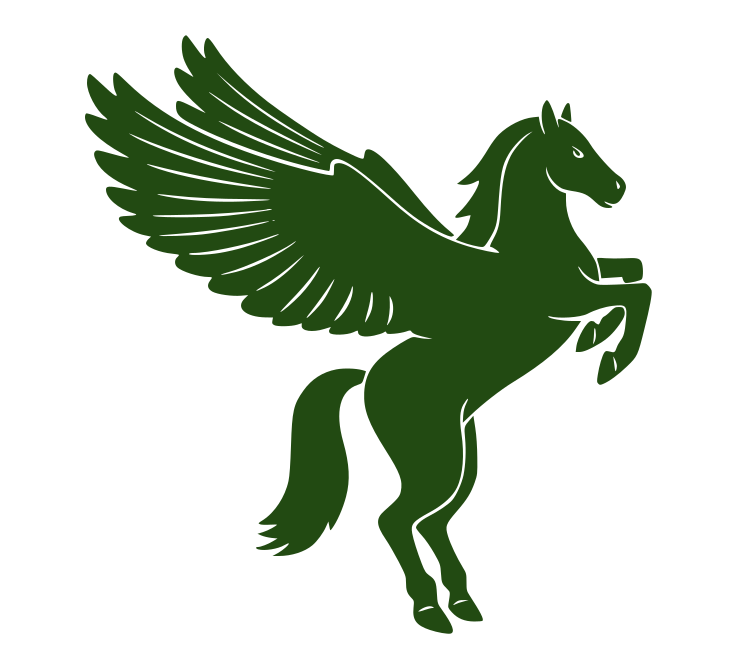

    <picture>
      <source media="(prefers-color-scheme: dark)" srcset="resources/hello_friend_dark.svg">
      <source media="(prefers-color-scheme: light)" srcset="resources/hellofriend.svg">
      
    </picture>

<picture>
  <source media="(prefers-color-scheme: dark)" srcset="resources/pegasus.svg">
  <source media="(prefers-color-scheme: light)" srcset="resources/pegasus_light.svg">
  
</picture>

### whoami

I'm **Aadish**, A passionate low level learner and a wannabe security researcher. I love networks. Interested in building any opensource software

 (https://twitter.com/Aavtic)

---

